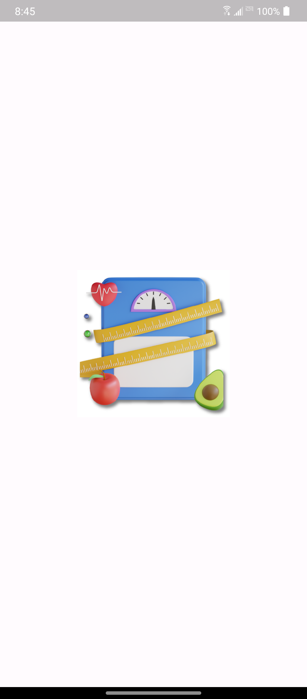
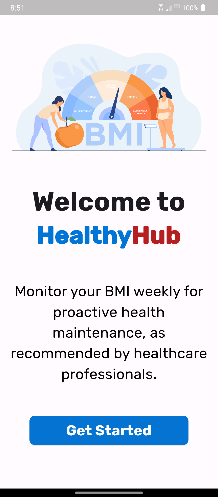
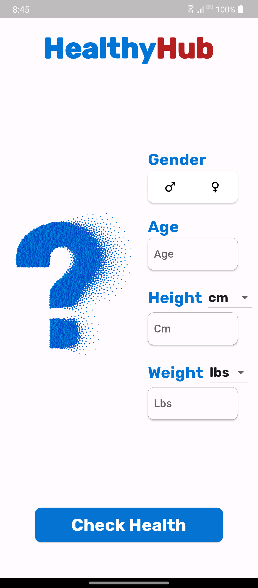
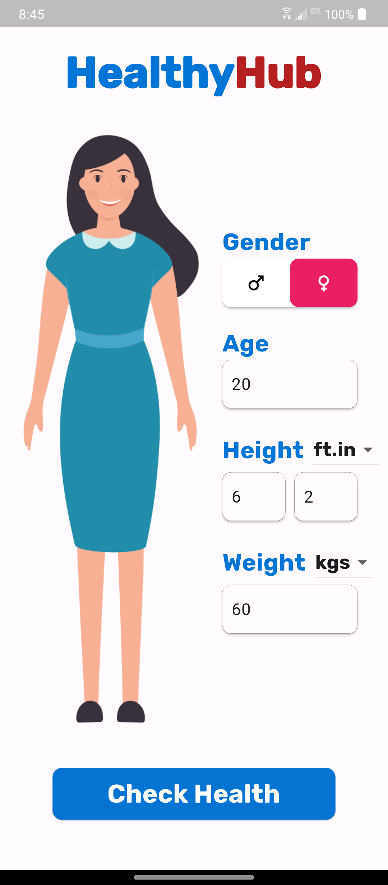
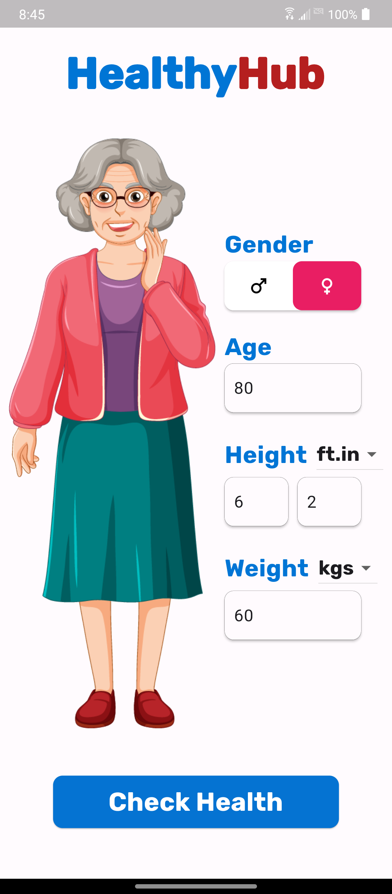
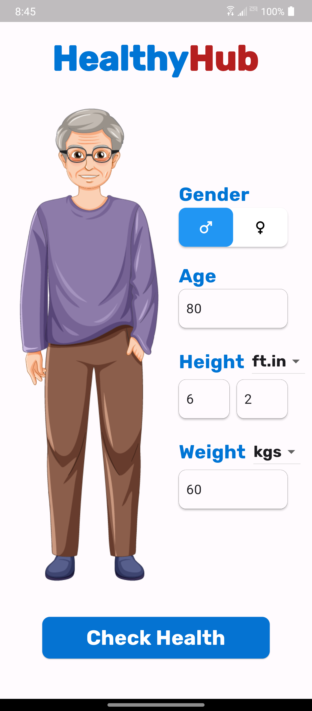
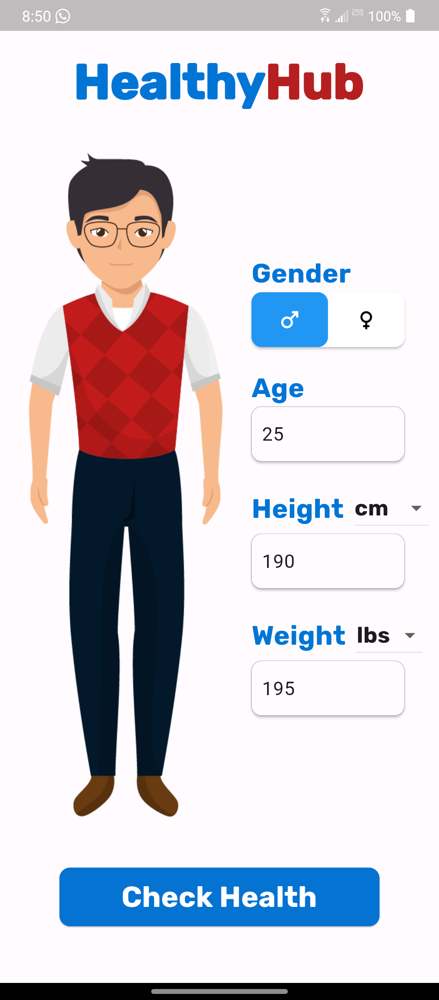
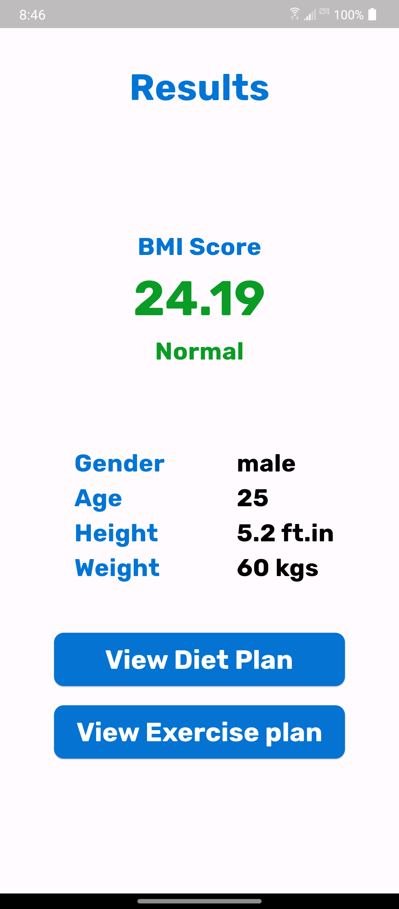
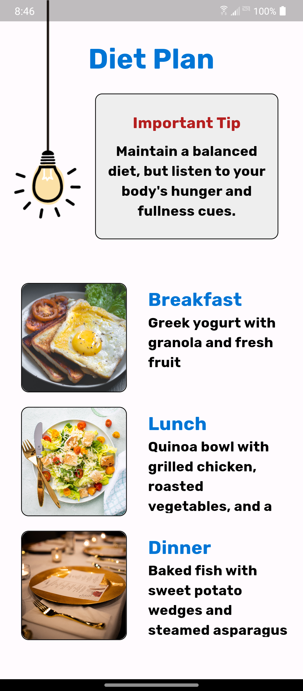
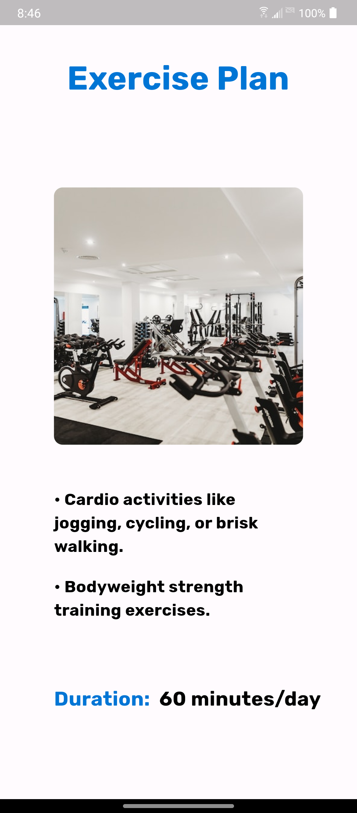

# HealthyHub App

**HealthyHub** is a mobile application designed to promote health and well-being by creating a personalized experience based on the user's age, gender, height, and weight. The app dynamically adjusts its interface to represent the user's characteristics in real-time. Additionally, it calculates and displays the user's Body Mass Index (BMI) on the next screen, providing valuable insights into their health.

## Features

### User Profile

- **Data Input:**
  - Collects user's age, gender, height, and weight information.
- **Dynamic UI:**
  - Adapts the interface based on age, displaying an aged appearance for users above 60.
  - Represents gender with appropriate visual elements (male or female).

### BMI Calculation

- **Real-time Calculation:**
  - Calculates and displays the user's BMI.
- **Feedback:**
  - Provides a clear understanding of the user's health status.

### Diet and Exercise Plans

- **Options:**
  - Offers two buttons for accessing diet and exercise plans.
- **Personalized Plans:**
  - Generates diet and exercise plans based on the user's age, gender, and BMI.
  
### Error Handling

- **Robust Validation:**
  - Ensures accurate data input through proper error handling.
  - Displays user-friendly error messages for a seamless experience.

### Analysis

- **Perfect Diet and Exercise Plans:**
  - Utilizes thorough analysis to recommend ideal diet plans and exercises tailored to the user's age and gender.

## Technologies Used

- **UI Framework:** Flutter
- **Responsiveness:** Screenutils package(responsive for mobile, tablet, iPad)
- **Navigation:** GetxNavigation
- **BMI Calculation:** Custom Logic
- **Error Handling:** Flutter's Form Validation
## Getting Started

1. Clone the repository:

```bash
git clone https://github.com/osmughal01/healthyhub.git
```
2. Install dependencies: flutter pub get
  
3. Run the application: flutter run

## Screenshots
<table>
  <tr>
    <td align="center"></td>
    <td align="center"></td>
    <td align="center"></td>
    <td align="center"></td>
  </tr>
  <tr>
    <td align="center"></td>
    <td align="center"></td>
    <td align="center"></td>
    <td align="center"></td>
  </tr>
  <tr>
    <td align="center"></td>
    <td align="center"></td>
  </tr>
</table>

## Contributing
If you want to contribute to this project, follow these steps:

Fork the repository.
Create a new branch for your feature: git checkout -b feature-name
Commit your changes: git commit -m 'Add some feature'
Push to the branch: git push origin feature-name
Submit a pull request.

## License
This project is licensed under the MIT License.

